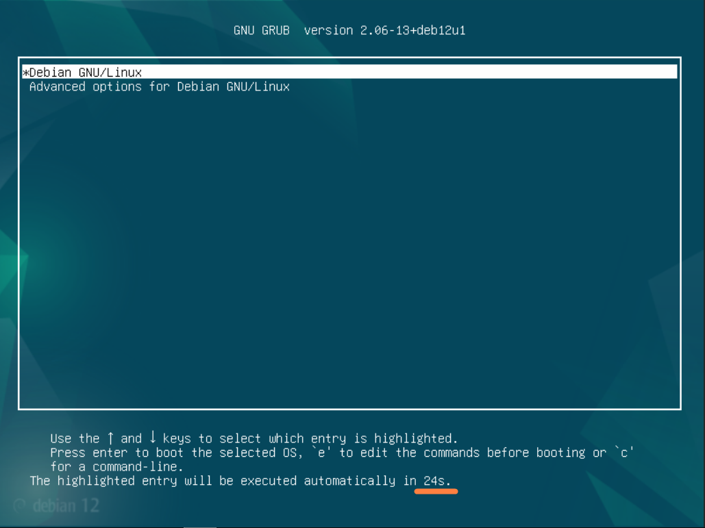
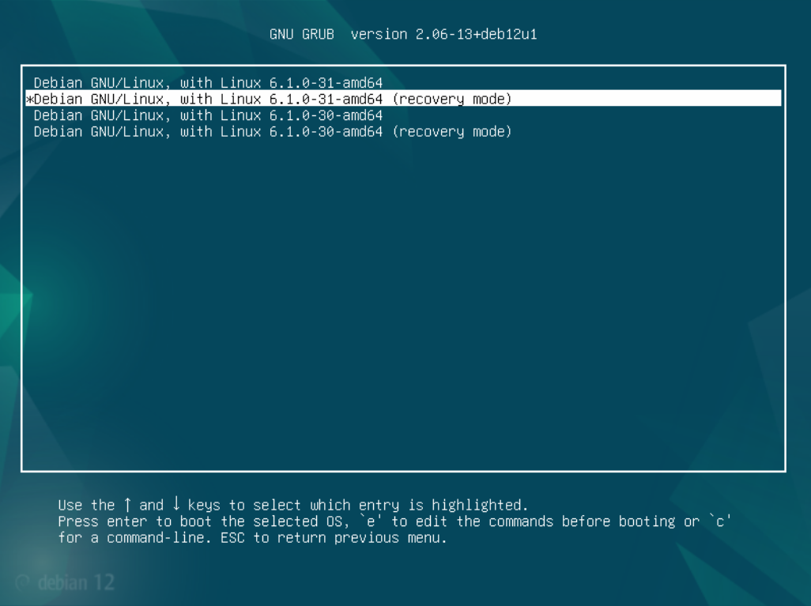

# Загрузка системы. GRUB2. 

## Рабочее пространство
Система виртуализации **PROXMOX 8.3.1**  

### Конфигурация виртуальной машины
> Debian GNU/Linux 12 (bookworm)  
> CPU: x86-64-v2-AES  
> Sockets: 2  
> Memory: 1024  
> Hard disk 0: 32G  
> BIOS: SeaBIOS  
> Machine: i440fx  

## Меню GRUB
В OS **Debian GNU/Linux 12 (bookworm)** по умолчанию при загрузке меню GRUB отображается в течении 5 секунд  
За это отвечает параметр **GRUB_TIMEOUT=5** в файле **/etc/default/grub**  
  
Если хотим полностью скрыть отображение меню во время запуска системы в файле **/etc/default/grub** должны быть утсановлены следующие значения:
```bash
GRUB_TIMEOUT_STYLE=hidden
GRUB_TIMEOUT=0
```
После изменения конфигурационного файла необходимо обновить конфигурацию и перезагрузить систему:
> root@Otus-debian:~# update-grub
```
Generating grub configuration file ...
Found background image: /usr/share/images/desktop-base/desktop-grub.png
Found linux image: /boot/vmlinuz-6.1.0-31-amd64
Found initrd image: /boot/initrd.img-6.1.0-31-amd64
Found linux image: /boot/vmlinuz-6.1.0-30-amd64
Found initrd image: /boot/initrd.img-6.1.0-30-amd64
Warning: os-prober will not be executed to detect other bootable partitions.
Systems on them will not be added to the GRUB boot configuration.
Check GRUB_DISABLE_OS_PROBER documentation entry.
done
```

> root@Otus-debian:~# reboot

### Для отображения меню во время запуска системы будем использовать следующие параметры:
```bash
#GRUB_TIMEOUT_STYLE=hidden # не используем этот параметр
GRUB_TIMEOUT=25 # время отображения меню - 25 секунд
```
Обновляем конфигураци и перезагружаем систему:
> root@Otus-debian:~# update-grub

> root@Otus-debian:~# reboot

**При запуске системы видим меню загрузчика, которое будет отображаться 25 секунд:**


## Зайти в систему без пароля
Используя загрузчик мы можем зайти в систему не имея пароля суперпользователя


### Advanced options
В меню загрузчика выбираем **Advanced options for Debian GNU/Linux** и далее пункт меню у которого в конце названия есть **(recovery mode)**



<!-- 
## Создаем свой RPM пакет

Устанавливаем необходимые пакеты:
> [root@otus-alma ~]# dnf install -y wget rpmdevtools rpm-build createrepo yum-utils cmake gcc git nano

Скачиваем SRPM-пакет (Source RPM) для Nginx – это исходный код пакета, упакованный в .src.rpm:
> [root@otus-alma /]# yumdownloader --source nginx
```
подключение репозитория appstream-source
подключение репозитория baseos-source
подключение репозитория extras-source
AlmaLinux 9 - AppStream - Source                                                                   442 kB/s | 844 kB     00:01
AlmaLinux 9 - BaseOS - Source                                                                      146 kB/s | 283 kB     00:01
AlmaLinux 9 - Extras - Source                                                                      4.5 kB/s | 8.2 kB     00:01
nginx-1.20.1-20.el9.alma.1.src.rpm                                                                 1.2 MB/s | 1.1 MB     00:00
```
Распаковываем исходники из .src.rpm:
> [root@otus-alma /]# rpm -ivh nginx-*.src.rpm

Для SRPM **-U** и **-i** ведут себя одинаково, потому что исходные RPM не устанавливаются, а просто распаковываются.  
Для обычных бинарных RPM (.rpm) разница есть:  
**-U** обновляет пакет, а **-i** просто устанавливает новый, не удаляя старую версию.  
В случае SRPM можно смело использовать **-i**, так как обновление здесь не имеет смысла.  
Эта команда установит файлы в каталог **/root/rpmbuild/SOURCES/** и **/root/rpmbuild/SPECS/**.  
Файлы помещаются в соответствующие директории:  
**SPECS/** — файл спецификации (.spec), описывающий процесс сборки.  
**SOURCES/** — архив с исходным кодом и возможные патчи. 

> [root@otus-alma /]# ls -la /root/rpmbuild/
```
итого 4
drwxr-xr-x. 4 root root   34 фев 14 15:45 .
dr-xr-x---. 5 root root  177 фев 14 15:45 ..
drwxr-xr-x. 2 root root 4096 фев 14 15:45 SOURCES
drwxr-xr-x. 2 root root   24 фев 14 15:45 SPECS
```
Устанавливаем все зависимости, необходимые для сборки Nginx из исходников.
> [root@otus-alma /]# yum-builddep nginx

Использует информацию из .spec файла пакета (в нашем случае /root/rpmbuild/SPECS/nginx.spec) для определения зависимостей.  
Работает только если пакет с .spec файлом доступен в репозиториях или уже установлен из SRPM.
Команда анализирует, какие пакеты указаны в секциях BuildRequires и Requires файла спецификации (nginx.spec).  
Затем yum устанавливает все эти пакеты, чтобы можно было собрать Nginx из исходников.

Клонируем репозиторий ngx_brotli (https://github.com/google/ngx_brotli)
> [root@otus-alma /]# cd /root/  

> [root@otus-alma ~]# git clone --recurse-submodules -j8 https://github.com/google/ngx_brotli
```
Клонирование в «ngx_brotli»...
remote: Enumerating objects: 237, done.
remote: Counting objects: 100% (37/37), done.
remote: Compressing objects: 100% (16/16), done.
remote: Total 237 (delta 24), reused 21 (delta 21), pack-reused 200 (from 1)
Получение объектов: 100% (237/237), 79.51 КиБ | 708.00 КиБ/с, готово.
Определение изменений: 100% (114/114), готово.
Подмодуль «deps/brotli» (https://github.com/google/brotli.git) зарегистрирован по пути «deps/brotli»
Клонирование в «/root/ngx_brotli/deps/brotli»...
remote: Enumerating objects: 7805, done.
remote: Counting objects: 100% (15/15), done.
remote: Compressing objects: 100% (13/13), done.
remote: Total 7805 (delta 3), reused 5 (delta 2), pack-reused 7790 (from 1)
Получение объектов: 100% (7805/7805), 40.62 МиБ | 16.20 МиБ/с, готово.
Определение изменений: 100% (5071/5071), готово.
Submodule path 'deps/brotli': checked out 'ed738e842d2fbdf2d6459e39267a633c4a9b2f5d'
```
**--recurse-submodules** – автоматически загружает и инициализирует все вложенные подмодули (если они есть).  
**-j8** – указывает количество параллельных потоков (в данном случае 8) для загрузки подмодулей, что ускоряет процесс.

В проекте **ngx_brotli** используется подмодуль с основной библиотекой Brotli. Если просто выполнить git clone, код подмодуля не загрузится, и сборка может не работать.  
С **--recurse-submodules** репозиторий загружается полностью, включая все зависимости.

Собираем модуль ngx_brotli:
> [root@otus-alma ~]# cd ngx_brotli/deps/brotli/

> [root@otus-alma brotli]# mkdir out && cd out

> [root@otus-alma out]# cmake -DCMAKE_BUILD_TYPE=Release -DBUILD_SHARED_LIBS=OFF -DCMAKE_C_FLAGS="-Ofast -m64 -march=native -mtune=native -flto -funroll-loops -ffunction-sections -fdata-sections -Wl,--gc-sections" -DCMAKE_CXX_FLAGS="-Ofast -m64 -march=native -mtune=native -flto -funroll-loops -ffunction-sections -fdata-sections -Wl,--gc-sections" -DCMAKE_INSTALL_PREFIX=./installed ..
```
-- The C compiler identification is GNU 11.5.0
-- Detecting C compiler ABI info
-- Detecting C compiler ABI info - done
-- Check for working C compiler: /usr/bin/cc - skipped
-- Detecting C compile features
-- Detecting C compile features - done
-- Build type is 'Release'
-- Performing Test BROTLI_EMSCRIPTEN
-- Performing Test BROTLI_EMSCRIPTEN - Failed
-- Compiler is not EMSCRIPTEN
-- Looking for log2
-- Looking for log2 - not found
-- Looking for log2
-- Looking for log2 - found
-- Configuring done (0.7s)
-- Generating done (0.0s)
CMake Warning:
  Manually-specified variables were not used by the project:

    CMAKE_CXX_FLAGS


-- Build files have been written to: /root/ngx_brotli/deps/brotli/out
```
> [root@otus-alma out]# cmake --build . --config Release -j 2 --target brotlienc
```
[  3%] Building C object CMakeFiles/brotlicommon.dir/c/common/constants.c.o
[  6%] Building C object CMakeFiles/brotlicommon.dir/c/common/context.c.o
[ 10%] Building C object CMakeFiles/brotlicommon.dir/c/common/dictionary.c.o
[ 13%] Building C object CMakeFiles/brotlicommon.dir/c/common/platform.c.o
[ 17%] Building C object CMakeFiles/brotlicommon.dir/c/common/shared_dictionary.c.o
[ 20%] Building C object CMakeFiles/brotlicommon.dir/c/common/transform.c.o
[ 24%] Linking C static library libbrotlicommon.a
[ 24%] Built target brotlicommon
[ 31%] Building C object CMakeFiles/brotlienc.dir/c/enc/backward_references.c.o
[ 31%] Building C object CMakeFiles/brotlienc.dir/c/enc/backward_references_hq.c.o
[ 34%] Building C object CMakeFiles/brotlienc.dir/c/enc/bit_cost.c.o
[ 37%] Building C object CMakeFiles/brotlienc.dir/c/enc/block_splitter.c.o
[ 41%] Building C object CMakeFiles/brotlienc.dir/c/enc/brotli_bit_stream.c.o
[ 44%] Building C object CMakeFiles/brotlienc.dir/c/enc/cluster.c.o
[ 48%] Building C object CMakeFiles/brotlienc.dir/c/enc/command.c.o
[ 51%] Building C object CMakeFiles/brotlienc.dir/c/enc/compound_dictionary.c.o
[ 55%] Building C object CMakeFiles/brotlienc.dir/c/enc/compress_fragment.c.o
[ 58%] Building C object CMakeFiles/brotlienc.dir/c/enc/compress_fragment_two_pass.c.o
[ 62%] Building C object CMakeFiles/brotlienc.dir/c/enc/dictionary_hash.c.o
[ 65%] Building C object CMakeFiles/brotlienc.dir/c/enc/encode.c.o
[ 68%] Building C object CMakeFiles/brotlienc.dir/c/enc/encoder_dict.c.o
[ 72%] Building C object CMakeFiles/brotlienc.dir/c/enc/entropy_encode.c.o
[ 75%] Building C object CMakeFiles/brotlienc.dir/c/enc/fast_log.c.o
[ 79%] Building C object CMakeFiles/brotlienc.dir/c/enc/histogram.c.o
[ 82%] Building C object CMakeFiles/brotlienc.dir/c/enc/literal_cost.c.o
[ 86%] Building C object CMakeFiles/brotlienc.dir/c/enc/memory.c.o
[ 89%] Building C object CMakeFiles/brotlienc.dir/c/enc/metablock.c.o
[ 93%] Building C object CMakeFiles/brotlienc.dir/c/enc/static_dict.c.o
[ 96%] Building C object CMakeFiles/brotlienc.dir/c/enc/utf8_util.c.o
[100%] Linking C static library libbrotlienc.a
[100%] Built target brotlienc
```
> [root@otus-alma out]# cd ../../../..

Чтобы **Nginx** собирался с необходимыми нам опциями добавляем указание на модуль в раздел **%build** в файле **nginx.spec**:
> [root@otus-alma ~]# nano /root/rpmbuild/SPECS/nginx.spec  

Добавляем строку 
```
--add-module=/root/ngx_brotli \
```
```
...
%build
# nginx does not utilize a standard configure script.  It has its own
# and the standard configure options cause the nginx configure script
# to error out.  This is is also the reason for the DESTDIR environment
# variable.
export DESTDIR=%{buildroot}
# So the perl module finds its symbols:
nginx_ldopts="$RPM_LD_FLAGS -Wl,-E"
if ! ./configure \
    --add-module=/root/ngx_brotli \
...
```

Собираем RPM пакет:
> [root@otus-alma ~]# cd rpmbuild/SPECS/

Запускаем сборку пакета на основе файла спецификации nginx.spec:
> [root@otus-alma SPECS]# rpmbuild -ba nginx.spec -D 'debug_package %{nil}'

Флаг **-b** указывает, что выполняется сборка, а:  
**-bb** — только бинарного пакета (.rpm),  
**-ba** — и бинарного, и исходного (.src.rpm).  
**-D 'debug_package %{nil}'** - отключает автоматическое создание пакета отладочной информации (debuginfo). По умолчанию rpmbuild создаёт дополнительный *-debuginfo.rpm, содержащий символы отладки.
**-D** позволяет переопределить макрос debug_package, установив его в nil, что означает отсутствие отладочного пакета.  
**Итог:**  
Эта команда собирает пакет Nginx без создания дебажного RPM-файла. Это может быть полезно, если вам не нужны отладочные символы, и вы хотите ускорить сборку или уменьшить размер выходных файлов.

```
Выполняется(%clean): /bin/sh -e /var/tmp/rpm-tmp.YwI8mY
+ umask 022
+ cd /root/rpmbuild/BUILD
+ cd nginx-1.20.1
+ /usr/bin/rm -rf /root/rpmbuild/BUILDROOT/nginx-1.20.1-20.el9.alma.1.x86_64
+ RPM_EC=0
++ jobs -p
+ exit 0
```

> [root@otus-alma SPECS]# ls -la /root/rpmbuild/RPMS/x86_64/
```
итого 1988
drwxr-xr-x. 2 root root    4096 фев 14 16:47 .
drwxr-xr-x. 4 root root      34 фев 14 16:47 ..
-rw-r--r--. 1 root root   36242 фев 14 16:47 nginx-1.20.1-20.el9.alma.1.x86_64.rpm
-rw-r--r--. 1 root root 1018882 фев 14 16:47 nginx-core-1.20.1-20.el9.alma.1.x86_64.rpm
-rw-r--r--. 1 root root  759669 фев 14 16:47 nginx-mod-devel-1.20.1-20.el9.alma.1.x86_64.rpm
-rw-r--r--. 1 root root   19367 фев 14 16:47 nginx-mod-http-image-filter-1.20.1-20.el9.alma.1.x86_64.rpm
-rw-r--r--. 1 root root   30943 фев 14 16:47 nginx-mod-http-perl-1.20.1-20.el9.alma.1.x86_64.rpm
-rw-r--r--. 1 root root   18169 фев 14 16:47 nginx-mod-http-xslt-filter-1.20.1-20.el9.alma.1.x86_64.rpm
-rw-r--r--. 1 root root   53815 фев 14 16:47 nginx-mod-mail-1.20.1-20.el9.alma.1.x86_64.rpm
-rw-r--r--. 1 root root   80446 фев 14 16:47 nginx-mod-stream-1.20.1-20.el9.alma.1.x86_64.rpm
```
Копируем пакеты в общий каталог:
> [root@otus-alma ~]# cp /root/rpmbuild/RPMS/noarch/* /root/rpmbuild/RPMS/x86_64/

Устанавливаем наш пакет и убедимся, что nginx работает:
> [root@otus-alma ~]# cd /root/rpmbuild/RPMS/x86_64/   

> [root@otus-alma x86_64]# yum localinstall *.rpm

**localinstall** — специальная команда, которая:  
- Устанавливает .rpm файлы из локальной директории (а не из репозиториев).  
- Автоматически разрешает зависимости путём загрузки недостающих пакетов из репозиториев.  
- *.rpm — означает установку всех RPM-файлов в текущей директории.  

В **dnf** команда **localinstall** больше не нужна — просто указывайте путь к файлу.
> [root@otus-alma x86_64]# dnf install *.rpm
```
Последняя проверка окончания срока действия метаданных: 0:01:19 назад, Пт 14 фев 2025 17:03:01.
Зависимости разрешены.
===================================================================================================================================
 Пакет                                    Архитектура         Версия                               Репозиторий               Размер
===================================================================================================================================
Установка:
 nginx                                    x86_64              2:1.20.1-20.el9.alma.1               @commandline               35 k
 nginx-all-modules                        noarch              2:1.20.1-20.el9.alma.1               @commandline              7.2 k
 nginx-core                               x86_64              2:1.20.1-20.el9.alma.1               @commandline              995 k
 nginx-filesystem                         noarch              2:1.20.1-20.el9.alma.1               @commandline              8.2 k
 nginx-mod-devel                          x86_64              2:1.20.1-20.el9.alma.1               @commandline              742 k
 nginx-mod-http-image-filter              x86_64              2:1.20.1-20.el9.alma.1               @commandline               19 k
 nginx-mod-http-perl                      x86_64              2:1.20.1-20.el9.alma.1               @commandline               30 k
 nginx-mod-http-xslt-filter               x86_64              2:1.20.1-20.el9.alma.1               @commandline               18 k
 nginx-mod-mail                           x86_64              2:1.20.1-20.el9.alma.1               @commandline               53 k
 nginx-mod-stream                         x86_64              2:1.20.1-20.el9.alma.1               @commandline               79 k
Установка зависимостей:
 almalinux-logos-httpd                    noarch              90.5.1-1.1.el9                       appstream                  18 k

Результат транзакции
===================================================================================================================================
Установка  11 Пакетов
```

> [root@otus-alma x86_64]# systemctl start nginx  

> [root@otus-alma x86_64]# systemctl status nginx  
```
● nginx.service - The nginx HTTP and reverse proxy server
     Loaded: loaded (/usr/lib/systemd/system/nginx.service; disabled; preset: disabled)
     Active: active (running) since Fri 2025-02-14 17:10:26 MSK; 2s ago
    Process: 35564 ExecStartPre=/usr/bin/rm -f /run/nginx.pid (code=exited, status=0/SUCCESS)
    Process: 35565 ExecStartPre=/usr/sbin/nginx -t (code=exited, status=0/SUCCESS)
    Process: 35566 ExecStart=/usr/sbin/nginx (code=exited, status=0/SUCCESS)
   Main PID: 35567 (nginx)
      Tasks: 3 (limit: 10963)
     Memory: 6.0M
        CPU: 45ms
     CGroup: /system.slice/nginx.service
             ├─35567 "nginx: master process /usr/sbin/nginx"
             ├─35568 "nginx: worker process"
             └─35569 "nginx: worker process"

фев 14 17:10:26 otus-alma systemd[1]: Starting The nginx HTTP and reverse proxy server...
фев 14 17:10:26 otus-alma nginx[35565]: nginx: the configuration file /etc/nginx/nginx.conf syntax is ok
фев 14 17:10:26 otus-alma nginx[35565]: nginx: configuration file /etc/nginx/nginx.conf test is successful
фев 14 17:10:26 otus-alma systemd[1]: Started The nginx HTTP and reverse proxy server.
```
**Nginx** установлен и запущен в нашей системе установлен с добавленым модулем:
> [root@otus-alma x86_64]# nginx -V
```
nginx version: nginx/1.20.1
built by gcc 11.5.0 20240719 (Red Hat 11.5.0-2) (GCC)
built with OpenSSL 3.2.2 4 Jun 2024
TLS SNI support enabled
configure arguments: --add-module=/root/ngx_brotli 
...
```

## Создаем свой репозиторий и разместим там ранее собранный RPM-пакет

Создаем директорию для репозитория:
> [root@otus-alma nginx]# cd /usr/share/nginx/html/

> [root@otus-alma html]# mkdir homerepo

Копируем в нее ранее собраные пакеты:
> [root@otus-alma html]# cp /root/rpmbuild/RPMS/x86_64/* /usr/share/nginx/html/homerepo/

Инициализируем репозиторий:
> [root@otus-alma html]# createrepo /usr/share/nginx/html/homerepo/
```
Directory walk started
Directory walk done - 10 packages
Temporary output repo path: /usr/share/nginx/html/homerepo/.repodata/
Preparing sqlite DBs
Pool started (with 5 workers)
Pool finished
```

Для доспупа в директорию отредактируем конфигурацию Nginx:
> [root@otus-alma html]# nano /etc/nginx/nginx.conf

Добавим в секцию **server** следующие строки:
```
    # Включаем autoindex ТОЛЬКО для /homerepo/
    location /homerepo/ {
        autoindex on;
        autoindex_exact_size off; # (необязательно) отображать размер файлов в КБ/МБ
        autoindex_localtime on;    # (необязательно) показывать локальное время файлов
    }
```

Перечитаем конфигурацию веб-сервера:
> [root@otus-alma html]# nginx -t
```
nginx: the configuration file /etc/nginx/nginx.conf syntax is ok
nginx: configuration file /etc/nginx/nginx.conf test is successful
```
> [root@otus-alma html]# nginx -s reload

Теперь перейдя по ссылке **http://10.126.112.236/homerepo/** мы увидим файлы наших RPM-пакетов (проверяю доступность с другой виртуальной машины):
> [root@otus-alma-client ~]# curl http://10.126.112.236/homerepo/
```
<html>
<head><title>Index of /homerepo/</title></head>
<body>
<h1>Index of /homerepo/</h1><hr><pre><a href="../">../</a>
<a href="repodata/">repodata/</a>                                          16-Feb-2025 11:21       -
<a href="nginx-1.20.1-20.el9.alma.1.x86_64.rpm">nginx-1.20.1-20.el9.alma.1.x86_64.rpm</a>              16-Feb-2025 11:20     35K
<a href="nginx-all-modules-1.20.1-20.el9.alma.1.noarch.rpm">nginx-all-modules-1.20.1-20.el9.alma.1.noarch.rpm</a>  16-Feb-2025 11:20    7357
<a href="nginx-core-1.20.1-20.el9.alma.1.x86_64.rpm">nginx-core-1.20.1-20.el9.alma.1.x86_64.rpm</a>         16-Feb-2025 11:20    995K
<a href="nginx-filesystem-1.20.1-20.el9.alma.1.noarch.rpm">nginx-filesystem-1.20.1-20.el9.alma.1.noarch.rpm</a>   16-Feb-2025 11:20    8440
<a href="nginx-mod-devel-1.20.1-20.el9.alma.1.x86_64.rpm">nginx-mod-devel-1.20.1-20.el9.alma.1.x86_64.rpm</a>    16-Feb-2025 11:20    742K
<a href="nginx-mod-http-image-filter-1.20.1-20.el9.alma.1.x86_64.rpm">nginx-mod-http-image-filter-1.20.1-20.el9.alma...&gt;</a> 16-Feb-2025 11:20     19K
<a href="nginx-mod-http-perl-1.20.1-20.el9.alma.1.x86_64.rpm">nginx-mod-http-perl-1.20.1-20.el9.alma.1.x86_64..&gt;</a> 16-Feb-2025 11:20     30K
<a href="nginx-mod-http-xslt-filter-1.20.1-20.el9.alma.1.x86_64.rpm">nginx-mod-http-xslt-filter-1.20.1-20.el9.alma.1..&gt;</a> 16-Feb-2025 11:20     18K
<a href="nginx-mod-mail-1.20.1-20.el9.alma.1.x86_64.rpm">nginx-mod-mail-1.20.1-20.el9.alma.1.x86_64.rpm</a>     16-Feb-2025 11:20     53K
<a href="nginx-mod-stream-1.20.1-20.el9.alma.1.x86_64.rpm">nginx-mod-stream-1.20.1-20.el9.alma.1.x86_64.rpm</a>   16-Feb-2025 11:20     79K
</pre><hr></body>
</html>
```
## Установка собранного пакета из своего репозитория
Используем чистую виртуальную машину на той же архитектуре  

### Конфигурация виртуальной машины
> AlmaLinux 9.5 (Teal Serval)  
> CPU: x86-64-v2-AES  
> Sockets: 2  
> Memory: 2048  
> Hard disk 0: 15G  
> BIOS: SeaBIOS  
> Machine: i440fx  

Добавим в систему наш репозиторий:
```
[root@otus-alma-client ~]# cat >> /etc/yum.repos.d/home-repo.repo << EOF
[home-repo]
name=home-repo
baseurl=http://10.126.112.236/homerepo
gpgcheck=0
enabled=1
EOF
```
В списке репозиториев видим свой **home-repo**:
> [root@otus-alma-client ~]# yum repolist enabled
```
repo id                                             repo name
appstream                                           AlmaLinux 9 - AppStream
baseos                                              AlmaLinux 9 - BaseOS
extras                                              AlmaLinux 9 - Extras
home-repo                                           home-repo
```
В репозитории **home-repo** видим список доступных пакетов:
> [root@otus-alma-client ~]# yum list | grep home
```
nginx.x86_64                                         2:1.20.1-20.el9.alma.1              home-repo
nginx-all-modules.noarch                             2:1.20.1-20.el9.alma.1              home-repo
nginx-core.x86_64                                    2:1.20.1-20.el9.alma.1              home-repo
nginx-filesystem.noarch                              2:1.20.1-20.el9.alma.1              home-repo
nginx-mod-devel.x86_64                               2:1.20.1-20.el9.alma.1              home-repo
nginx-mod-http-image-filter.x86_64                   2:1.20.1-20.el9.alma.1              home-repo
nginx-mod-http-perl.x86_64                           2:1.20.1-20.el9.alma.1              home-repo
nginx-mod-http-xslt-filter.x86_64                    2:1.20.1-20.el9.alma.1              home-repo
nginx-mod-mail.x86_64                                2:1.20.1-20.el9.alma.1              home-repo
nginx-mod-stream.x86_64                              2:1.20.1-20.el9.alma.1              home-repo
```
Установим **Nginx** из репозитория **home-repo**:
> [root@otus-alma-client ~]# dnf install --disablerepo=* --enablerepo=home-repo nginx
```
Last metadata expiration check: 0:15:45 ago on Sun 16 Feb 2025 12:38:09 PM MSK.
Dependencies resolved.
=====================================================================================================================
 Package               Architecture           Version                                Repository                 Size
=====================================================================================================================
Installing:
 nginx                 x86_64                 2:1.20.1-20.el9.alma.1                 home-repo                  35 k

Transaction Summary
=====================================================================================================================
Install  1 Package

Total download size: 35 k
Installed size: 148 k
Is this ok [y/N]: y
Downloading Packages:
nginx-1.20.1-20.el9.alma.1.x86_64.rpm                                                 16 MB/s |  35 kB     00:00
---------------------------------------------------------------------------------------------------------------------
Total                                                                                3.5 MB/s |  35 kB     00:00
Running transaction check
Transaction check succeeded.
Running transaction test
Transaction test succeeded.
Running transaction
  Preparing        :                                                                                             1/1
  Installing       : nginx-2:1.20.1-20.el9.alma.1.x86_64                                                         1/1
  Running scriptlet: nginx-2:1.20.1-20.el9.alma.1.x86_64                                                         1/1
  Verifying        : nginx-2:1.20.1-20.el9.alma.1.x86_64                                                         1/1

Installed:
  nginx-2:1.20.1-20.el9.alma.1.x86_64

Complete!
```
**Nginx** установлен, запустим его и првоерим что он работает:
> [root@otus-alma-client ~]# nginx -V
```
nginx version: nginx/1.20.1
built by gcc 11.5.0 20240719 (Red Hat 11.5.0-2) (GCC)
built with OpenSSL 3.2.2 4 Jun 2024
TLS SNI support enabled
configure arguments: --add-module=/root/ngx_brotli 
...
```
Видим что nginx в нашей системе сконфигурирован и установлен с параметром **--add-module=/root/ngx_brotli**
> [root@otus-alma-client ~]# systemctl start nginx.service

> [root@otus-alma-client ~]# systemctl status nginx.service
```
● nginx.service - The nginx HTTP and reverse proxy server
     Loaded: loaded (/usr/lib/systemd/system/nginx.service; disabled; preset: disabled)
     Active: active (running) since Sun 2025-02-16 12:57:05 MSK; 4s ago
    Process: 39087 ExecStartPre=/usr/bin/rm -f /run/nginx.pid (code=exited, status=0/SUCCESS)
    Process: 39088 ExecStartPre=/usr/sbin/nginx -t (code=exited, status=0/SUCCESS)
    Process: 39089 ExecStart=/usr/sbin/nginx (code=exited, status=0/SUCCESS)
   Main PID: 39090 (nginx)
      Tasks: 3 (limit: 10948)
     Memory: 4.2M
        CPU: 30ms
     CGroup: /system.slice/nginx.service
             ├─39090 "nginx: master process /usr/sbin/nginx"
             ├─39091 "nginx: worker process"
             └─39092 "nginx: worker process"

Feb 16 12:57:05 otus-alma-client systemd[1]: Starting The nginx HTTP and reverse proxy server...
Feb 16 12:57:05 otus-alma-client nginx[39088]: nginx: the configuration file /etc/nginx/nginx.conf syntax is ok
Feb 16 12:57:05 otus-alma-client nginx[39088]: nginx: configuration file /etc/nginx/nginx.conf test is successful
Feb 16 12:57:05 otus-alma-client systemd[1]: Started The nginx HTTP and reverse proxy server.
```
> [root@otus-alma-client ~]# curl -I http://127.0.0.1
```
HTTP/1.1 200 OK
Server: nginx/1.20.1
Date: Sun, 16 Feb 2025 09:59:27 GMT
Content-Type: text/html
Content-Length: 4681
Last-Modified: Sat, 09 Oct 2021 17:49:21 GMT
Connection: keep-alive
ETag: "6161d621-1249"
Accept-Ranges: bytes
```
#### Веб-сервер был установлен из локального репозитория и находится в рабочем состоянии.


 -->
