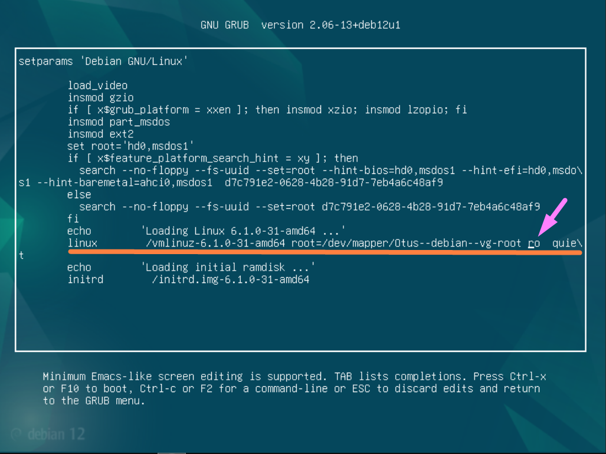
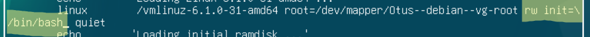
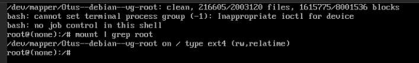
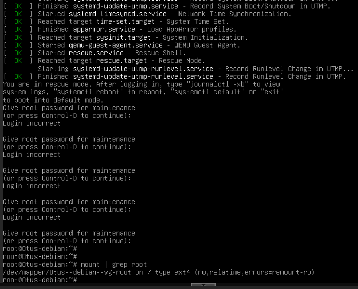
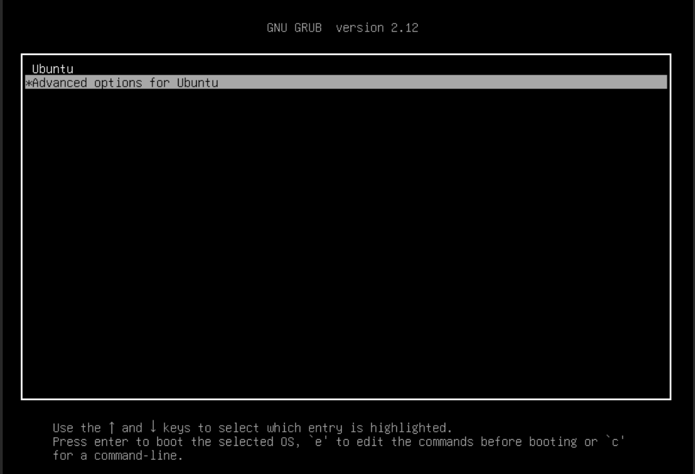
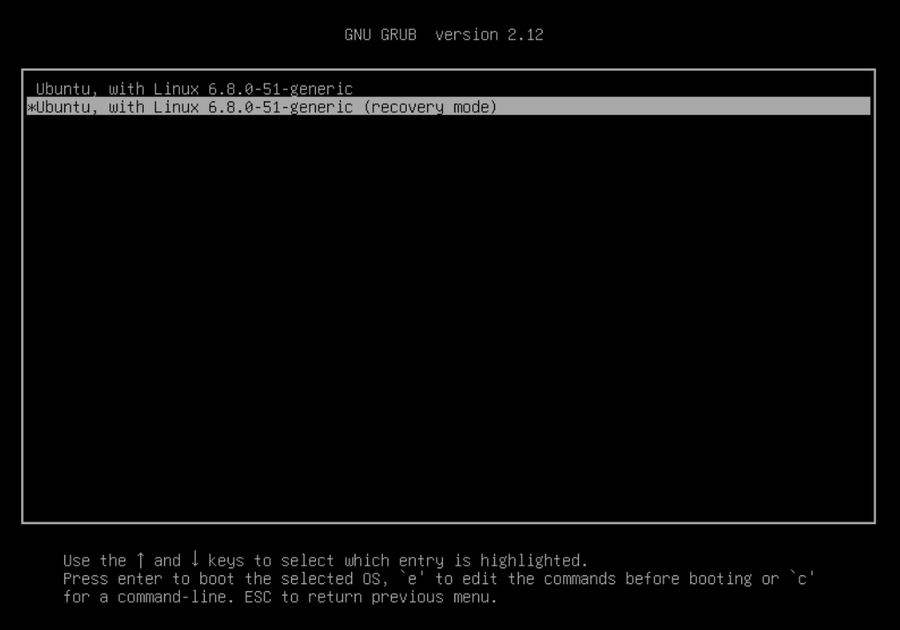
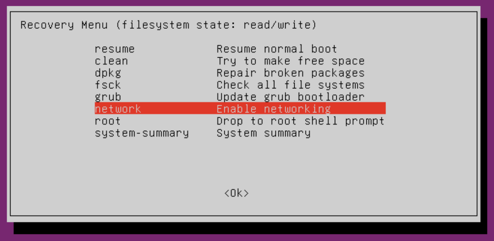
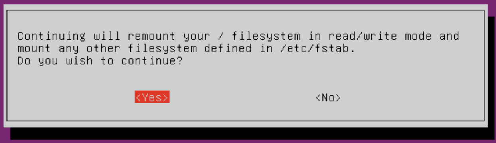
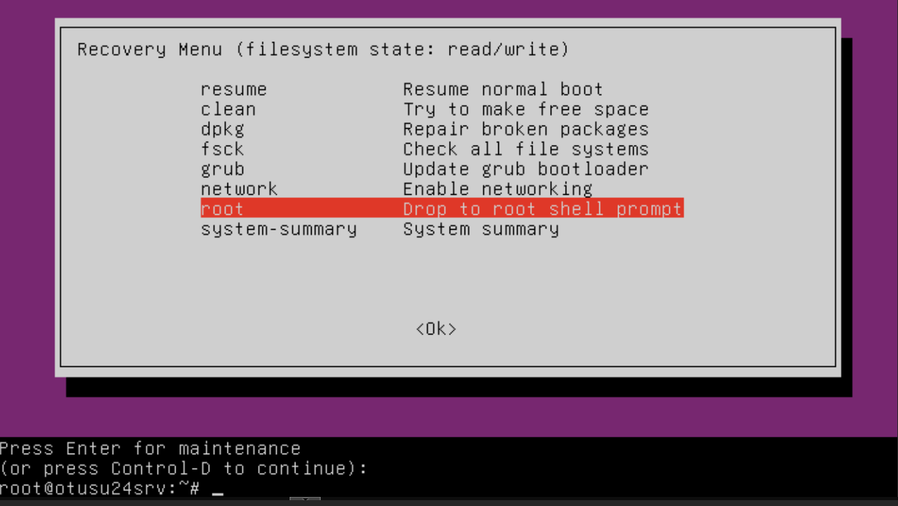

# Загрузка системы. GRUB2. 

## Рабочее пространство
Система виртуализации **PROXMOX 8.3.1**  

### Конфигурация виртуальной машины
> Debian GNU/Linux 12 (bookworm)  
> CPU: x86-64-v2-AES  
> Sockets: 2  
> Memory: 1024  
> Hard disk 0: 32G  
> BIOS: SeaBIOS  
> Machine: i440fx  

## Меню GRUB
В OS **Debian GNU/Linux 12 (bookworm)** по умолчанию при загрузке меню GRUB отображается в течении 5 секунд  
За это отвечает параметр **GRUB_TIMEOUT=5** в файле **/etc/default/grub**  
  
Если хотим полностью скрыть отображение меню во время запуска системы в файле **/etc/default/grub** должны быть утсановлены следующие значения:
```bash
GRUB_TIMEOUT_STYLE=hidden
GRUB_TIMEOUT=0
```
После изменения конфигурационного файла необходимо обновить конфигурацию и перезагрузить систему:
> root@Otus-debian:~# update-grub
```
Generating grub configuration file ...
Found background image: /usr/share/images/desktop-base/desktop-grub.png
Found linux image: /boot/vmlinuz-6.1.0-31-amd64
Found initrd image: /boot/initrd.img-6.1.0-31-amd64
Found linux image: /boot/vmlinuz-6.1.0-30-amd64
Found initrd image: /boot/initrd.img-6.1.0-30-amd64
Warning: os-prober will not be executed to detect other bootable partitions.
Systems on them will not be added to the GRUB boot configuration.
Check GRUB_DISABLE_OS_PROBER documentation entry.
done
```

> root@Otus-debian:~# reboot

### Для отображения меню во время запуска системы будем использовать следующие параметры:
```bash
#GRUB_TIMEOUT_STYLE=hidden # не используем этот параметр
GRUB_TIMEOUT=25 # время отображения меню - 25 секунд
```
Обновляем конфигураци и перезагружаем систему:
> root@Otus-debian:~# update-grub

> root@Otus-debian:~# reboot

**При запуске системы видим меню загрузчика, которое будет отображаться 25 секунд:**


## Зайти в систему без пароля
Используя загрузчик мы можем зайти в систему не имея пароля суперпользователя

### Редактор со сценарием загрузки
В меню загрузчика нажимаем клавишу **e** и попадаем в редактор со сценарием загрузки:

Ищем строку которая начинается с:
```
linux         /vmlinuz...
```
В конце строки вместо **ro** пишем **rw init=/bin/bash** и запускаем загрузку системы нажатием **F10** или **Ctrl+x**:

Попадаем в консоль от имени суперпользователя, где файловая система доступна для записи:


### Advanced options
В меню загрузчика выбираем **Advanced options for Debian GNU/Linux** и далее пункт меню у которого в конце названия есть **(recovery mode)**:

На данной системе потребуется пароль суперпользователя, введя его мы попадаем в сисему в режиме *recovery mode*:


### Advanced options на Ubuntu 24
В меню загрузчика выбираем **Advanced options for Ububntu**:

Выбираем пункт меню у которого в конце названия есть **(recovery mode)**:

В **Recovery Menu** включаем поддержку сети - **network    Enable networking** чтобы файловая система перемонтировалась в режиме **RW** и подтверждаем действие:


Выбираем пункт **root** и попадаем в консоль с пользователем **root** (по умолчанию пароля нет, но если ранее был установлен, то его придется ввести):


## Переименовать Volum Group на уже установленной системе
Исходное название **VG** в системе - **Otus-debian-vg**:
>root@Otus-debian:~# vgs
```
  VG             #PV #LV #SN Attr   VSize   VFree
  Otus-debian-vg   1   2   0 wz--n- <31.52g 44.00m
```
Переименуем:
>root@Otus-debian:~# vgrename Otus-debian-vg Debian-Otus
```
  Volume group "Otus-debian-vg" successfully renamed to "Debian-Otus"
```
1. Правим файл конфигурации загрузки **/boot/grub/grub.cfg**.  
Заменяем старое название **VG** - **Otus-debian-vg** на новое **Debian-Otus** во всех местах где оно встречается.  
**ОБЯЗАТЕЛЬНО** заменяем дефис на два дефиса! Если имя **VG** - **Debian-Otus**, то в файле **/boot/grub/grub.cfg** пишем **Debian--Otus**.
```bash
root@Otus-debian:~# cat /boot/grub/grub.cfg  | grep Otus
        linux   /vmlinuz-6.1.0-31-amd64 root=/dev/mapper/Debian--Otus-root ro  quiet
                linux   /vmlinuz-6.1.0-31-amd64 root=/dev/mapper/Debian--Otus-root ro  quiet
                linux   /vmlinuz-6.1.0-31-amd64 root=/dev/mapper/Debian--Otus-root ro single
                linux   /vmlinuz-6.1.0-30-amd64 root=/dev/mapper/Debian--Otus-root ro  quiet
                linux   /vmlinuz-6.1.0-30-amd64 root=/dev/mapper/Debian--Otus-root ro single
```

2. Правим файл монтирования дисков **/etc/fstab** (если требуется).  
Заменяем старое название **VG** - **Otus-debian-vg** на новое **Debian-Otus** во всех местах где оно встречается.  
В нашем случае правим монтирование для **/** и **swap**:
```bash
#/dev/mapper/Otus--debian--vg-root /               ext4    errors=remount-ro 0       1
/dev/mapper/Debian--Otus-root /               ext4    errors=remount-ro 0       1
# /boot was on /dev/sda1 during installation
UUID=d7c791e2-0628-4b28-91d7-7eb4a6c48af9 /boot           ext2    defaults        0       2
#/dev/mapper/Otus--debian--vg-swap_1 none            swap    sw              0       0
/dev/mapper/Debian--Otus-swap_1 none            swap    sw              0       0
```

3. Обновим **GRUB** и **initramfs**.
> root@Otus-debian:~# update-grub

> root@Otus-debian:~# update-initramfs -u -k all
```
update-initramfs: Generating /boot/initrd.img-6.1.0-31-amd64
W: initramfs-tools configuration sets RESUME=/dev/mapper/Otus--debian--vg-swap_1
W: but no matching swap device is available.
I: The initramfs will attempt to resume from /dev/dm-1
I: (/dev/mapper/Debian--Otus-swap_1)
I: Set the RESUME variable to override this.
update-initramfs: Generating /boot/initrd.img-6.1.0-30-amd64
W: initramfs-tools configuration sets RESUME=/dev/mapper/Otus--debian--vg-swap_1
W: but no matching swap device is available.
I: The initramfs will attempt to resume from /dev/dm-1
I: (/dev/mapper/Debian--Otus-swap_1)
I: Set the RESUME variable to override this.
```
Эта команда обновляет **initramfs** (initial RAM filesystem) для всех установленных ядер.
- **-u (update)** — обновляет initramfs, не пересоздавая его с нуля.
- **-k all** — обновляет все установленные версии ядра.

#### Перезагружаем систему и видим новое имя на Volume Group
>root@Otus-debian:~# vgs
```
  VG          #PV #LV #SN Attr   VSize   VFree
  Debian-Otus   1   2   0 wz--n- <31.52g 44.00m
```
> root@Otus-debian:~# df -hT
```
Filesystem                    Type      Size  Used Avail Use% Mounted on
udev                          devtmpfs  448M     0  448M   0% /dev
tmpfs                         tmpfs      97M 1012K   96M   2% /run
/dev/mapper/Debian--Otus-root ext4       30G  5.5G   23G  20% /
tmpfs                         tmpfs     481M     0  481M   0% /dev/shm
tmpfs                         tmpfs     5.0M     0  5.0M   0% /run/lock
/dev/sda1                     ext2      455M  144M  287M  34% /boot
tmpfs                         tmpfs      97M   40K   97M   1% /run/user/108
tmpfs                         tmpfs      97M   36K   97M   1% /run/user/1000
```
> root@Otus-debian:~# lsblk
```
NAME                    MAJ:MIN RM  SIZE RO TYPE MOUNTPOINTS
sda                       8:0    0   32G  0 disk
├─sda1                    8:1    0  487M  0 part /boot
├─sda2                    8:2    0    1K  0 part
└─sda5                    8:5    0 31.5G  0 part
  ├─Debian--Otus-root   254:0    0 30.5G  0 lvm  /
  └─Debian--Otus-swap_1 254:1    0  976M  0 lvm  [SWAP]
```