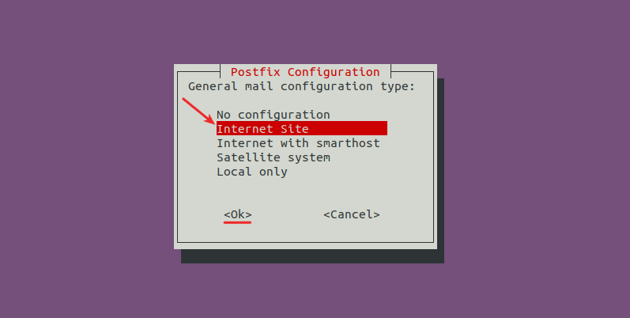
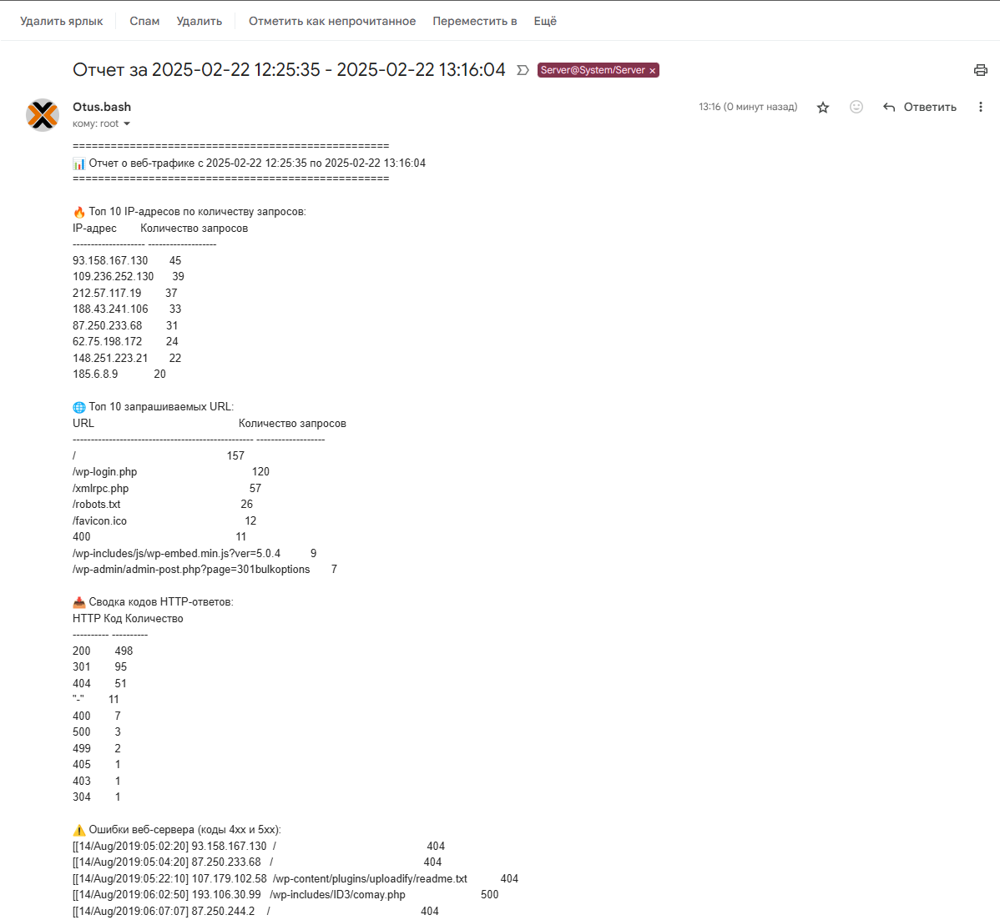

# Bash 

## Рабочее пространство
Система виртуализации **PROXMOX 8.3.1**  

### Конфигурация виртуальной машины
> Debian GNU/Linux 12 (bookworm)  
> CPU: x86-64-v2-AES  
> Sockets: 2  
> Memory: 1024  
> Hard disk 0: 32G  
> BIOS: SeaBIOS  
> Machine: i440fx  

## Скрипт для анализа лога web-сервера с отправкой отчета на почту

### Создаем файл скрипта
Создаю директорию **/scripts** в которой создаю файл с именем **web_log_analizer**
> root@Otus-debian:/# mkdir scripts

> root@Otus-debian:/# touch /scripts/web_log_analizer

> root@Otus-debian:/# chmod +x /scripts/web_log_analizer

Будем работать с логами **Nginx**, которые по умолчанию располагаются в **/var/log/nginx/access.log**.  
Отправлять отчет будем для **root**.  

[Посмотреть скрипт](https://github.com/Resovalko/Otus-Linux-Adm-Prof/blob/main/13-14-Bash/web_log_analizer)

#### Проверим работу скрипта
> root@Otus-debian:/scripts# ./web_log_analizer
```
Будет использоваться команда 'mail' для отправки писем.
Письмо успешно отправлено пользователю root.
```
У нас появилось новое письмо
> root@Otus-debian:/scripts# mail
```
Mail version 8.1.2 01/15/2001.  Type ? for help.
"/var/mail/root": 1 message 1 new
>N  1 root@Otus-debian.  Sat Feb 22 12:25  126/8343  Отчет за 2025-02-22 12:25:14 - 2025-02-22 12:25:35
&
```
Прочитаем его:
```
Message 1:
From root@Otus-debian.lan  Sat Feb 22 12:25:35 2025
X-Original-To: root
To: root@Otus-debian.lan
Subject: Отчет за 2025-02-22 12:25:14 - 2025-02-22 12:25:35
MIME-Version: 1.0
Content-Type: text/plain; charset="UTF-8"
Content-Transfer-Encoding: 8bit
Date: Sat, 22 Feb 2025 12:25:35 +0300 (MSK)
From: root <root@Otus-debian.lan>

==================================================
📊 Отчет о веб-трафике с 2025-02-22 12:25:14 по 2025-02-22 12:25:35
==================================================

🔥 Топ 10 IP-адресов по количеству запросов:
IP-адрес        Количество запросов
-------------------- -------------------
93.158.167.130       45
109.236.252.130      39
212.57.117.19        37
188.43.241.106       33
87.250.233.68        31
62.75.198.172        24
148.251.223.21       22
185.6.8.9            20

🌐 Топ 10 запрашиваемых URL:
URL                                                Количество запросов
-------------------------------------------------- -------------------
/                                                  157
/wp-login.php                                      120
/xmlrpc.php                                        57
/robots.txt                                        26
/favicon.ico                                       12
400                                                11
/wp-includes/js/wp-embed.min.js?ver=5.0.4          9
/wp-admin/admin-post.php?page=301bulkoptions       7

📥 Сводка кодов HTTP-ответов:
HTTP Код Количество
---------- ----------
200        498
301        95
404        51
"-"        11
400        7
500        3
499        2
405        1
403        1
304        1

⚠️ Ошибки веб-сервера (коды 4xx и 5xx):
[[14/Aug/2019:05:02:20] 93.158.167.130  /                                                  404
[[14/Aug/2019:05:04:20] 87.250.233.68   /                                                  404
[[14/Aug/2019:05:22:10] 107.179.102.58  /wp-content/plugins/uploadify/readme.txt           404
[[14/Aug/2019:06:02:50] 193.106.30.99   /wp-includes/ID3/comay.php                         500
[[14/Aug/2019:06:07:07] 87.250.244.2    /                                                  404
[[14/Aug/2019:06:13:53] 77.247.110.165  /robots.txt                                        404
[[14/Aug/2019:06:45:20] 87.250.233.76   /                                                  404
[[14/Aug/2019:07:07:19] 71.6.199.23     /robots.txt                                        404
[[14/Aug/2019:07:07:20] 71.6.199.23     /sitemap.xml                                       404
[[14/Aug/2019:07:07:20] 71.6.199.23     /.well-known/security.txt                          404
[[14/Aug/2019:07:07:21] 71.6.199.23     /favicon.ico                                       404
[[14/Aug/2019:07:09:43] 141.8.141.136   /                                                  404
[[14/Aug/2019:08:10:56] 93.158.167.130  /                                                  404
[[14/Aug/2019:08:21:48] 87.250.233.68   /                                                  404
...
```
#### Добавим запись в **cron** что бы периодически выполнять скрипт и получать отчет
> root@Otus-debian:/scripts# crontab -e

Добавим строку:
```
0 * * * * /scripts/web_log_analizer > /scripts/web_log_analizer.log 2>&1
```
Скрипт будет выполняться каждый час и записывать небольшой лог.

### Отправка отчета на внешний адрес электронной почты (на примере gmail)
Если система настроена на отправку сообщений на внешние адреса электронной почты, то мы можем получать результаты работы скрипта не в кносоль, а на свой адрес электронной почты.  

Нам потребуется **Postfix**:
> root@Otus-debian:/scripts# apt install postfix postfix-pcre libsasl2-modules mailutils



#### Сконфигурируем Postfix
Приведем файл [**/etc/postfix/main.cf**](https://github.com/Resovalko/Otus-Linux-Adm-Prof/blob/main/13-14-Bash/main.cf) к следующему виду:
```
# See /usr/share/postfix/main.cf.dist for a commented, more complete version


# Debian specific:  Specifying a file name will cause the first
# line of that file to be used as the name.  The Debian default
# is /etc/mailname.
#myorigin = /etc/mailname

smtpd_banner = $myhostname ESMTP $mail_name (Debian/GNU)
biff = no

# appending .domain is the MUA's job.
append_dot_mydomain = no

# Uncomment the next line to generate "delayed mail" warnings
#delay_warning_time = 4h

#readme_directory = no

# See http://www.postfix.org/COMPATIBILITY_README.html -- default to 3.6 on
# fresh installs.
compatibility_level = 3.6

myhostname = Otus-debian.lan
alias_maps = hash:/etc/aliases
alias_database = hash:/etc/aliases
mydestination = $myhostname, Otus-debian, localhost.localdomain, localhost
mynetworks = 127.0.0.0/8
recipient_delimiter = +
inet_interfaces = loopback-only

#google mail
relayhost = smtp.gmail.com:587
smtp_use_tls = yes
smtp_sasl_auth_enable = yes
smtp_sasl_security_options = noanonymous
smtp_sasl_password_maps = hash:/etc/postfix/sasl_passwd
smtp_tls_CAfile = /etc/ssl/certs/Entrust_Root_Certification_Authority.pem
smtp_tls_session_cache_database = btree:/var/lib/postfix/smtp_tls_session_cache
smtp_tls_session_cache_timeout = 3600s
smtp_header_checks = pcre:/etc/postfix/smtp_header_checks
```
**Создадим файл с логином и паролем для SMTP:**
> root@Otus-debian:/scripts# echo "smtp.gmail.com your-email@gmail.com:YourAppPassword" > /etc/postfix/sasl_passwd

> root@Otus-debian:/scripts# postmap hash:/etc/postfix/sasl_passwd

> root@Otus-debian:/scripts# chmod 600 /etc/postfix/sasl_passwd /etc/postfix/sasl_passwd.db

> root@Otus-debian:/scripts# nano /etc/postfix/smtp_header_checks

Добавим сюда такую запись:
```
/^From:.*/ REPLACE From: Otus.bash otus.bash@something.com
```
> root@Otus-debian:/scripts# postmap hash:/etc/postfix/smtp_header_checks

> root@Otus-debian:/scripts# systemctl restart postfix

Отредактируем файл **/etc/aliases**:
> root@Otus-debian:/scripts#  nano /etc/aliases

Ищем строку, начинающуюся с root: и изменяем её (либо добавляем строку, если её нет) указывая адрес почты на который хотим получать письма для **root**:
```
root: yourusername@gmail.com
```
И применим изменения:
> root@Otus-debian:/scripts# newaliases

**Проверить можем отправив тестовое письмо:**
> root@Otus-debian:/scripts#  echo "Test message" | mail -s "Test Subject" yourusername@gmail.com

#### Если все сделано правильно, в результате работы скрипта мы должны получить письмо на тот электронный адрес, который указали в конфигах

